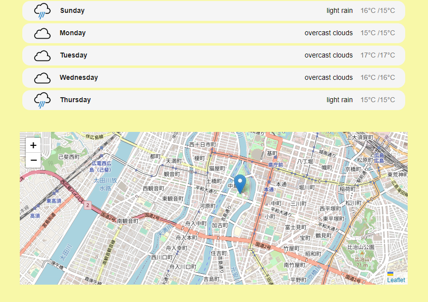
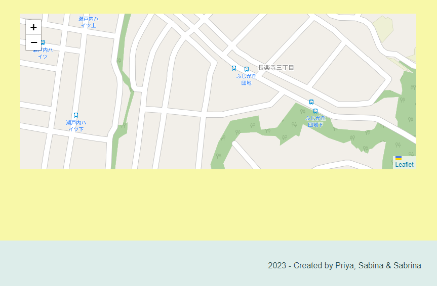
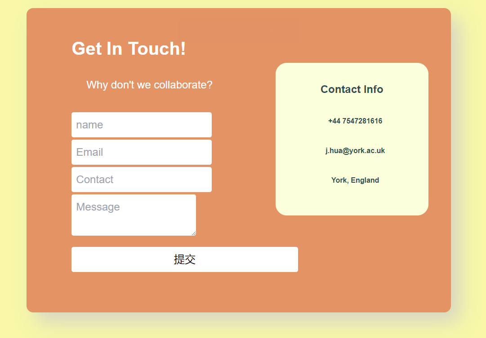

# Weather React Forecast
MIT 

## Description
An interactive weather forecast app that provides real-time data, with user-friendly interface, and easy-to-use features to solve the problem of having access to accurate and up-to-date weather forecast information of a selected location. 

The key components of our weather forecast app includes seven day weather forecast, location-based map services, and responsive design. The weather forecast for seven days can be retrieved by searching and selecting a city/town. The app makes use of the geoDB cities API to display the corresponding geospatial maps.

## Table of Contents
- [Weather React Forecast](#weather-react-forecast)
  - [Description](#description)
  - [Table of Contents](#table-of-contents)
  - [User Story](#user-story)
  - [Features](#features)
  - [Languages \& Dependencies](#languages--dependencies)
  - [How to Use This Application](#how-to-use-this-application)
  - [Deployed Application URL](#deployed-application-url)
  - [Usage](#usage)
  - [Illustration](#illustration)
  - [Contributors](#contributors)
  - [Testing](#testing)
  - [Questions](#questions)

## User Story
As a end user, I need an easy web app which allows me to search for a specific city or town so that I can retrieve an up-to-date seven day weather forecast easily.
Further, I want to view a geospatial interactive map for the selected location.
Finally, the interface should display weather forecast specific attributes namely temperature, wind, humidity & pressure.

## Features
Using of Geolocation Map to pinpoint the weather of the city searched for.

## Languages & Dependencies
* Inquirer 6.5.3 
* Bootstrap 5.2
* Jest 5.16
* React 13.3
* React-leaflet 4.2.1
* React- router-dom 6.9

## How to Use This Application
API: 
* React-leaflet 
* GeoDB cities 
* Openweather
libraries: 
* react-accessible-accordion 
* react-select-async-paginate 
* jest-dom 
* tailwind

The site is deployed using Netlify.

## Deployed Application URL
https://interactive-weather-forecast.netlify.app/

## Usage 
For planning your everyday life and special journey. For people away from home and their loved ones, this App also serve as something that that evokes nostalgia.

## Illustration
The following images illustrate the website's appearance and functionality:

## Contributors
priyadarsini-gunasekaran, Sabina Akinbusuyi, SabrinaHuajy. Big thanks to Dan with mysterious glasses, our team TA Ryan, Brittani and other dedicated TAs for their help and supports.

## Testing
npm test,Launches the test runner in the interactive watch mode.

## Questions
Please send your questions to :

<a href="mailto:priyasatish1626@gmail.com" rel="noreferrer">priyasatish1626@gmail.com</a>
 
<a href="mailto:j.hua@york.ac.uk" rel="noreferrer">j.hua@york.ac.uk</a>
 
<a href="mailto:akinbusuyi@gmail.com" rel="noreferrer">akinbusuyi@gmail.com</a>

Or visit:

https://github.com/SabrinaHuajy 
 
https://github.com/Akinbusuyi
 
https://github.com/priyadarsini-gunasekaran
