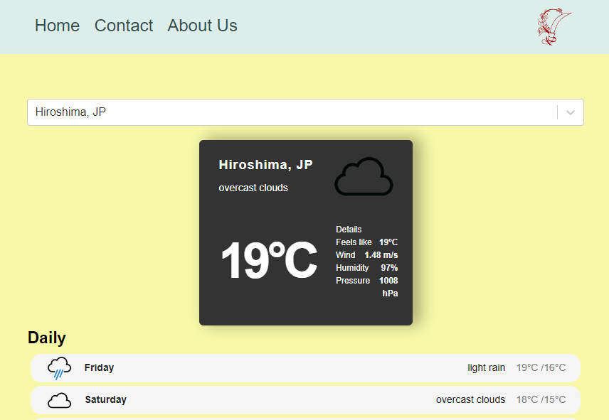

# Weather React Forecast 
MIT 

# Getting Started with Create React App
This project was bootstrapped with [Create React App](https://github.com/facebook/create-react-app).

## Description
Using React App and several APIs to create seven day weather forecast for selected city and show it's location on an interactive Leaflet map.

## Table of Contents
* [Features](#features)
* [Languages & Dependencies](#languagesanddependencies)
* [How to Use This Application](#HowtoUseThisApplication)
* [Contributors](#contributors)
* [Testing](#testing)
* [Questions](#questions)

## Features
Using of Geolocation Map to pinpoint the weather of the city searched for.

## Languages & Dependencies
* Inquirer 6.5.3 
* Bootstrap 5.2
* Jest 5.16
* React 13.3
* React-leaflet 4.2.1
* React- router-dom 6.9

## How to Use This Application:
API: 
* React-leaflet 
* GeoDB cities 
* Openweather
libraries: 
* react-accessible-accordion 
* react-select-async-paginate 
* jest-dom 
* tailwind

The site is deployed using Netlify.

## Deployed Application URL
https://interactive-weather-forecast.netlify.app/

## Usage 
For planning your everyday life and special journey. For people away from home and their loved ones, this App also serve as something that that evokes nostalgia.

## Illustration
The following images illustrate the website's appearance and functionality:

## Contributors
priyadarsini-gunasekaran, Sabina Akinbusuyi, SabrinaHuajy. Big thanks to Dan with mysterious glasses, our team TA Ryan, Brittani and other dedicated TAs for their help and supports.

## Testing
npm test,Launches the test runner in the interactive watch mode.

# Getting Started with Create React App
This project was bootstrapped with [Create React App](https://github.com/facebook/create-react-app).

## Questions
Please send your questions to :

priyasatish1626@gmail.com
j.hua@york.ac.uk
akinbusuyi@gmail.com 

Or visit:

https://github.com/SabrinaHuajy 
https://github.com/Akinbusuyi
https://github.com/priyadarsini-gunasekaran
